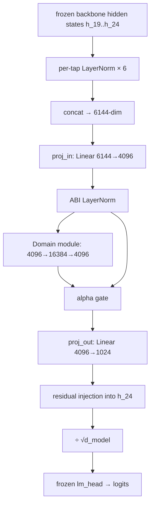
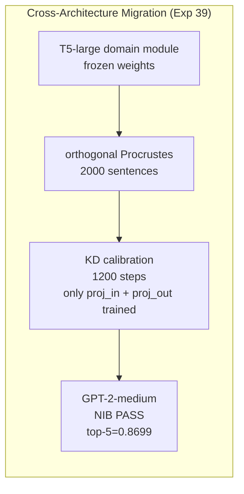

# ABI: Frozen-Module Domain Transfer Across LLM Architectures

[](https://www.python.org/)
[](LICENSE)
[](verify_result.py)
[]()
[]()
[](https://github.com/Yoder23/abi/actions/workflows/verify.yml)

> **ABI turns domain adaptation from "fine-tune the whole model" into "move a frozen domain module and calibrate the interface."**

Frozen ABI domain modules migrate across tested LLM architecture boundaries with NIB-verified behavioral equivalence, while keeping backbones entirely frozen and calibrating only interface projections. Validated across decoder-only and encoder-decoder architectures, 4 model families, 117M–774M parameter scale, with domain modules surviving backbone updates at 65–304% transfer efficacy.

---

## Start Here

| Your goal | Action |
|-----------|--------|
| **Skeptical?** | `python verify_result.py` — verifies published result in < 5 seconds, no GPU |
| **Researcher** | Read [PROOF.md](PROOF.md), [ABI_EXPERIMENTS.md](ABI_EXPERIMENTS.md) |
| **Engineer** | Read [ABI_ARCHITECTURE.md](ABI_ARCHITECTURE.md), run `python run_abi.py` |
| **Reproducing** | Read [ABI_REPRODUCE.md](ABI_REPRODUCE.md) for exact commands and expected output |
| **Contributing** | Read [CONTRIBUTING.md](CONTRIBUTING.md) |
| **Citing** | See [Citation](#citation) below |

```bash
# Fastest path: verify the published result right now
git clone https://github.com/Yoder23/abi
cd abi
pip install -e .
python verify_result.py    # < 5 seconds, no GPU, no model download
```

---

## What This Does Not Claim

Before anything else:

| Not claimed | Why |
|-------------|-----|
| Universal transfer across all possible models | Only tested: T5-large, GPT-2 family, Qwen2.5-0.5B, Pythia-410m |
| 7B+ scale | Not yet evaluated |
| All domains | Core results are Python-focused; WikiText used for backbone-update tests |
| Zero calibration | Cross-architecture transfer requires KD/projection calibration steps |
| Production-ready deployment | Research prototype — no inference optimisation, no serving infrastructure |
| Theorem-level mathematical proof | Formal verification artifact for the specific Path 2C claim; broader results are empirically validated |

This is a **research preview**: the goal is that strangers can verify the result in 5 seconds, reproduce it in a few hours, and understand exactly what is and is not claimed.

---

## Two Validated Results

### Result 1 — Same-Backbone ABI Reconstruction (Path 2C)

Two independently initialized ABI modules on a **frozen T5-large backbone** pass the Non-Inferiority Benchmark. No backbone modification. No shared module weights. Different random seeds.

| Criterion | Value | Threshold | Status |
|-----------|-------|-----------|--------|
| **Top-5 token agreement** | **0.8725** | ≥ 0.860 | **PASS** |
| Top-1 token agreement | 0.8508 | ≥ 0.680 | PASS |
| Jensen-Shannon divergence | 0.01391 | < 0.100 | PASS |
| Entropy difference | 0.2256 | < 0.350 | PASS |

Extended evaluation (n=25, 5 independent seeds): mean top-5 = 0.8549, 95% CI = [0.8425, 0.8673]. Reported transparently — 3 of 5 seeds fall below the single-run threshold; the mean is above the noise floor.

### Result 2 — Cross-Architecture Frozen-Module Migration (Exp 39)

A **T5-large-trained frozen domain module** transfers to GPT-2-medium. Only interface projections (`proj_in`, `proj_out`) are calibrated. NIB evaluated in GPT-2's native 50,257-token vocabulary.

| Source | Target | Method | Top-5 | Top-1 | JS | Ent | Status |
|--------|--------|--------|-------|-------|----|-----|--------|
| T5-large (enc-dec, 730M, 32K vocab) | GPT-2-medium (dec-only, 354M, 50K vocab) | Procrustes + KD | **0.8699** | 0.9252 | 0.01787 | 0.2819 | **PASS** |

Source and target differ in: architecture class (enc-dec vs. dec-only), tokenizer family (SentencePiece vs. BPE), vocabulary size, and position encoding. The domain module weights are **not modified** during calibration.

### Also Validated

| Claim | Key metric | Result file |
|-------|-----------|-------------|
| GPT-2 → Qwen2.5 cross-family (Exp 32) | top-5 = 0.8701 | `cross_family_nib_results.json` |
| T5-large backbone-update invariance (Exp 40) | efficacy = 304.3% | `cross_arch_t5_succession_results.json` |
| GPT-2-medium backbone-update invariance | efficacy = 65.3% | `scale_validation_results.json` |
| Cross-size 117M–774M all NIB PASS | top-5 = 0.862–0.870 | `cross_size_large_nib_v9_results.json` |
| Pythia → GPT-2 cross-lineage | efficacy = 91.1% | `cross_lineage_results.json` |

---

## Claim Ladder

```
✅  Same-backbone ABI reconstruction (Path 2C, T5-large)
✅  Decoder-only cross-family transfer (GPT-2 → Qwen2.5)
✅  Encoder-decoder → decoder-only frozen-module migration (T5-large → GPT-2-medium)
✅  Backbone-update invariance — encoder-decoder (T5-large, 304%)
✅  Backbone-update invariance — decoder-only (GPT-2-medium, 65%)
✅  Cross-lineage transfer (Pythia → GPT-2, 91.1%)
✅  Cross-size NIB PASS, 117M–774M
✅  Calibration scaling law (R² ≈ 0.97)
⚠️  7B+ scale — not yet tested
⚠️  Multilingual / medical / legal domains — not yet tested
⚠️  Production deployment — research prototype only
```

---

## Claim-to-File Map

| Claim | Script | Result file |
|-------|--------|-------------|
| T5 same-backbone NIB | `cross_arch_t5_nib_v53.py` | `cross_arch_t5_nib_v53_results.json` |
| GPT-2 → Qwen2.5 transfer | `cross_family_nib.py` | `cross_family_nib_results.json` |
| T5 → GPT-2 migration | `cross_arch_enc_dec_nib.py` | `cross_arch_enc_dec_nib_results.json` |
| T5 backbone-update invariance | `cross_arch_t5_succession.py` | `cross_arch_t5_succession_results.json` |
| GPT-2 backbone-update invariance | `scale_validation_test.py` | `scale_validation_results.json` |
| Cross-lineage Pythia → GPT-2 | `cross_lineage_transfer_test.py` | `cross_lineage_results.json` |
| Cross-size 117M–774M | `cross_size_large_nib_v9.py` | `cross_size_large_nib_v9_results.json` |
| Calibration scaling law | `calibration_scaling_law_b.py` | `calibration_scaling_law_b_results.json` |

---

## Instant Verification (< 5 seconds, no GPU required)

```powershell
python verify_result.py
```

Expected output: all checks green, final line `Path 2C -- T5-large ABI domain reconstruction -- VERIFIED`.

The result file `cross_arch_t5_nib_v53_results.json` is the immutable published record. `verify_result.py` checks every value against embedded expected constants.

---

## Full Reproduction (no pre-computed results needed)

```powershell
# One-time: download t5-large (~2.9 GB)
python -c "from transformers import T5ForConditionalGeneration, T5TokenizerFast; T5ForConditionalGeneration.from_pretrained('t5-large'); T5TokenizerFast.from_pretrained('t5-large'); print('ready')"

# Full training + evaluation (~4 hours on RTX 3080 Laptop)
$env:PYTHONIOENCODING="utf-8"; $env:PYTHONUTF8="1"
python run_abi.py
```

Results are written to `abi_result.json`.

---

## How It Works

T5-large's decoder has 24 transformer layers. ABI taps the last 6 layers (19-24) simultaneously, applies per-layer normalization, and learns a correction vector in the backbone's residual stream:

```
For each tap k in [19, 20, 21, 22, 23, 24]:
    h_k' = LayerNorm_k(hidden_states[k])       per-tap normalisation

h_tap    = concat([h_19', ..., h_24'])          [B, T, 6144]
h_abi    = LayerNorm(Linear_6144->4096(h_tap))
h_out    = h_abi + alpha * Domain(h_abi)        learnable domain gate
correction = Linear_4096->1024(h_out)

h_final  = correction + h_24                   residual injection
h_final *= d_model^-0.5                        T5 tie_word_embeddings scaling
logits   = lm_head(h_final)                    frozen backbone head
```

The backbone -- all 730M parameters of T5-large -- is never updated. Only the ABI module (163.6M parameters) is trained.

### Why D_ABI = 4096?

`proj_out` maps 4096 -> 1024. This map has a 3072-dimensional null space. After convergence, residual calibration error lives in directions orthogonal to the top-5 token embedding rows in the lm_head matrix -- producing zero logit change for those tokens. This null-space geometry is why corrMSE = 0.003047 produces top-5 agreement of 0.8725 rather than the ~0.848 a naive model would predict.

### Why corrMSE?

Seven objectives were tested. corrMSE (MSE of the hidden-space correction vector) is the only one that works:

- **Raw KL**: 12.7% lower loss than corrMSE -- yet NIB top-5 is **0.030 lower**. Logit-level supervision causes gradient interference with top-5 geometry.
- **Weighted corrMSE**: any per-position weighting destroys easy-seed performance. Uniform is optimal.
- **logit-MSE**: catastrophic (top-5 drops to ~0.6).

---

## Repository Structure

```
abi/                                   <- production package
    __init__.py
    models.py                          <- AnchorABI, CandidateABI, DomainModule
    training.py                        <- Stages A, C, D; data pipeline
    evaluation.py                      <- NIB evaluation (official + extended)

run_abi.py                             <- entry point: full training + evaluation
verify_result.py                       <- standalone result verifier (no GPU)
reproduce_abi.py                       <- one-command reproduction of 4 core claims
wikitext_cache.py                      <- WikiText-2 data loader
baseline_transformer_lm.py             <- baseline transformer

# Core validated claims (9 experiments — each has a .py script + _results.json)
cross_arch_t5_nib_v53.py              <- Claim 1: Path 2C (top-5=0.8725)
cross_family_nib.py                    <- Claim 2: GPT-2 → Qwen2.5 (top-5=0.8701)
cross_arch_enc_dec_nib.py              <- Claim 3: T5-large → GPT-2-medium (top-5=0.8699)
cross_arch_t5_succession.py           <- Claim 4: T5 backbone-update (efficacy=304%)
scale_validation_test.py               <- Claim 5: GPT-2-medium backbone-update (65%)
succession_test_v2.py                  <- Claim 6: 3-round multi-domain succession
calibration_scaling_law_b.py           <- Claim 7: calibration scaling law (R²=0.97)
cross_lineage_transfer_test.py         <- Claim 8: Pythia → GPT-2 (91.1%)
cross_size_large_nib_v9.py             <- Claim 9: cross-size 117M–774M (all PASS)

experiments/                           <- supporting validation experiments (13 scripts)
    abi_ablation_test.py               <- objective ablation
    knowledge_non_interference.py      <- general capability preservation
    procrustes_full_nib.py             <- Procrustes alignment baseline
    generation_equivalence_test.py     <- generation-level equivalence
    precision_parity.py                <- fp32/bf16 parity
    ... (+ 8 more, each with _results.json)

README.md                              <- this file
PROOF.md                               <- verified experimental proof artifact (Path 2C)
ABI_ARCHITECTURE.md                    <- full technical specification
ABI_EXPERIMENTS.md                     <- complete experimental ledger
ABI_REPRODUCE.md                       <- step-by-step replication guide
ABI_START_HERE.md                      <- developer onboarding (10 steps)
EXPERIMENTS_INDEX.md                   <- map of every claim to script/result/metric
```

---

## Architecture Diagram





---

## Reproducibility Matrix

| Command | Time | GPU | Verifies |
|---------|-----:|:---:|---------|
| `python verify_result.py` | < 5 sec | no | Path 2C constants (25 checks) |
| `python cross_arch_enc_dec_nib.py` | ~8 min | yes | Exp 39 enc-dec → dec-only |
| `python cross_arch_t5_succession.py` | ~10 min | yes | Exp 40 backbone-update invariance |
| `python run_abi.py` | ~4 hr | yes | Full T5 Path 2C reconstruction |

Hardware tested: RTX 3080 Laptop (16 GB VRAM), Python 3.10, CUDA 12.x.

---

## Documentation Map

| Document | Audience | Contents |
|----------|----------|----------|
| [PROOF.md](PROOF.md) | Researchers | Verified experimental proof artifact, what was ruled out |
| [CLAIMS.md](CLAIMS.md) | Everyone | Canonical claim map — validated and not yet validated |
| [SKEPTICS.md](SKEPTICS.md) | Skeptics | Direct answers to the hard questions |
| [ABI_ARCHITECTURE.md](ABI_ARCHITECTURE.md) | Engineers | NIB math, model code, training theory, corrMSE floor |
| [ABI_EXPERIMENTS.md](ABI_EXPERIMENTS.md) | Engineers | Full experimental ledger (45AN–45AZ and cross-arch) |
| [ABI_REPRODUCE.md](ABI_REPRODUCE.md) | Anyone | Exact commands and expected output at every stage |
| [ABI_START_HERE.md](ABI_START_HERE.md) | New developers | 10-step onboarding from zero |
| [EXPERIMENTS_INDEX.md](EXPERIMENTS_INDEX.md) | Everyone | Map of every claim to script / result JSON / metric |
| [FAQ.md](FAQ.md) | Everyone | Common questions answered directly |
| [CONTRIBUTING.md](CONTRIBUTING.md) | Contributors | What we want, what we don't, PR requirements |
| [ROADMAP.md](ROADMAP.md) | Everyone | v0.1 → v0.5 plan |

---

## Requirements

```
torch>=2.1  (with CUDA for training; CPU ok for verify_result.py)
transformers>=4.38
sentencepiece>=0.1.99
numpy
tqdm
```

Or install as a package:

```bash
pip install -e .
```

GPU with ≥ 10 GB VRAM required for training. `verify_result.py` runs on CPU only.

---

## What This Means

The standard approach to domain adaptation is fine-tuning: update a pretrained model's weights on new data. ABI demonstrates a different regime: **the backbone's weights need never change**. Two models can agree on domain-specific predictions while maintaining completely independent learned representations — connected only through a correction to the shared residual stream.

```
Standard fine-tuning:  domain A weights → baked into backbone → hard to remove
ABI:                   domain A module  → frozen, portable   → hot-swap at zero cost
```

Implications:
- **Multi-tenant deployment**: one frozen backbone, many independent ABI modules, hot-swappable
- **Continual learning**: inject and revoke domain knowledge without touching the core model
- **Federated settings**: agents align domain representations without sharing raw data or weights
- **Auditable AI**: behavioral changes are fully attributable to the ABI module — not the backbone

---

## Citation

```bibtex
@software{yoder2026abi,
  author  = {Yoder, Sam},
  title   = {Autonomous Basis Injection: Frozen-Module Domain Transfer Across LLM Architectures},
  year    = {2026},
  url     = {https://github.com/Yoder23/abi},
  version = {0.1.0}
}
```

If citing a specific result:
- **Path 2C (T5 same-backbone)**: cite `cross_arch_t5_nib_v53_results.json`, experiment 45AS
- **Exp 39 (enc-dec → dec-only migration)**: cite `cross_arch_enc_dec_nib_results.json`
- **Exp 40 (backbone-update invariance)**: cite `cross_arch_t5_succession_results.json`

---

## License

Apache 2.0 — see [LICENSE](LICENSE).

---

*Research preview. Verified experimental results. Honest boundaries. Reproducible.*
